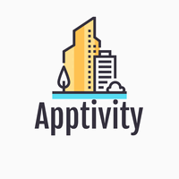

<div id="top"></div>

<!-- PROJECT LOGO -->
<br />
<div align="center">
  <a href="https://github.com/egyyudanugraha/capstone-project">
    
  </a>

<h3 align="center">Apptivity</h3>

  <p align="center">
    Manage your task with Apptivity
    <br />
    <a href="#top"><strong>Explore the docs »</strong></a>
    <br />
    <br />
    <a href="https://apptivity-v1.netlify.app">View Deployed App</a>
    ·
    <a href="https://github.com/egyyudanugraha/capstone-project/issues">Report Bug</a>
    ·
    <a href="https://github.com/egyyudanugraha/capstone-project/issues">Request Feature</a>
  </p>
</div>


<!-- TABLE OF CONTENTS -->
<details>
  <summary>Table of Contents</summary>
  <ol>
    <li>
      <a href="#about-the-project">About The Project</a>
      <ul>
        <li><a href="#built-with">Built With</a></li>
      </ul>
    </li>
    <li>
      <a href="#getting-started">Getting Started</a>
      <ul>
        <li><a href="#prerequisites">Prerequisites</a></li>
        <li><a href="#installation">Installation</a></li>
      </ul>
    </li>
    <li><a href="#roadmap">Roadmap</a></li>
    <li><a href="#contact">Contact</a></li>
    <li><a href="#acknowledgments">Acknowledgments</a></li>
  </ol>
</details>


<!-- ABOUT THE PROJECT -->
## About Apptivity

[](https://apptivity-v1.netlify.app)
[](https://apptivity-v1.netlify.app)

#### Support Dark Mode
[](https://apptivity-v1.netlify.app)

Apptivity adalah productivity tools berbasis website yang digunakan untuk memudahkan pengguna dalam mengimplementasikan berbagai macam teknik-teknik produktivitas seperti Pomodoro, Eisenhower Matrix, Kaizen, dan terdapat juga berbagai artikel yang membahas segala hal berkaitan dengan produktivitas.

Project Apptivity dibangun untuk memenuhi tugas akhir atau Capstone Project pada program Studi Independen Bersertifikat - Batch 2.

<p align="right">(<a href="#top">back to top</a>)</p>


### Built With

* [HTML](https://html.com/)
* [Javascript](https://www.javascript.com/)
* [Tailwind](https://tailwindcss.com/)

#### APIs
* [Apptivity API V3](https://apptivity-api-v3.herokuapp.com/) See docs [here](https://github.com/egyyudanugraha/capstone-project/tree/backend-v3)
* [GNews API](https://gnews.io/)

<p align="right">(<a href="#top">back to top</a>)</p>


<!-- GETTING STARTED -->
## Getting Started

How to install local apptivity on your laptop? let's follow the instructions

### Prerequisites
* Node Js (v14.17.6 or higher)


### Installation
  #### Note
  This project required API KEY from [GNews](https://gnews.io/). To get the API KEY please register [here](https://gnews.io/register)

1. Clone this repository (main branch)
   ```sh
   git clone https://github.com/egyyudanugraha/capstone-project.git
   ```
2. Install NPM packages
   ```sh
   npm install
   ```
3. Create file `.env` in root project folder
   ```js
   // FOR PRODUCTION
   API_KEY='YOUR_API_FROM_GNEWS'
   BASE_URL_API='https://apptivity-api-v3.herokuapp.com'
   BASE_URL_NEWS='https://gnews.io/api/v4/search'
   PUBLIC_KEY_SERVER='BF0iNOeRThs_SsOTc1s77KuIozBdxeaLM5aegT5-UsccCdg2QN9bZQ_a4SZtZ_Y09-ytma00m4AeHqYvk5MZuJA'
   
   // FOR DEVELOPMENT (Please start local back-end server)
   API_KEY='YOUR_API_FROM_GNEWS'
   BASE_URL_API='http://localhost:3000'
   BASE_URL_NEWS='https://gnews.io/api/v4/search'
   PUBLIC_KEY_SERVER='BF0iNOeRThs_SsOTc1s77KuIozBdxeaLM5aegT5-UsccCdg2QN9bZQ_a4SZtZ_Y09-ytma00m4AeHqYvk5MZuJA'
   ```
4. Run the server!
   ```sh
   npm run start-dev
   ```
   Yeay! Server running on [localhost](http://localhost:8080/)
   
   #### Optional
   For the styling development please run tailwind, open new tab on terminal.
   ```sh
   npm run tailwind
   ```
   To build this project for production, run command
   ```sh
   npm run build
   ```
<p align="right">(<a href="#top">back to top</a>)</p>


<!-- ROADMAP -->
## Roadmap

- [x] Build Backend for APIs, [see this](https://github.com/egyyudanugraha/capstone-project/tree/backend-v3)
- [x] Authenticate & Authorize with JWT
- [x] Tasks
- [x] Eisenhower Matrix
- [x] Pomodoro
- [x] History of completed task
- [x] Articles productivity
- [x] Dark mode
- [x] Progressive Web App
- [x] Notification service
- [x] Landing page
- [ ] How to use


<p align="right">(<a href="#top">back to top</a>)</p>

<!-- CONTACT -->
## Contact

- [Arijaya Putra](https://www.instagram.com/arijayaa/)
- [Yuda](https://www.instagram.com/_yuda23_)
- [Aditya](https://www.instagram.com/)
- [Seli](https://www.instagram.com/)

<p align="right">(<a href="#top">back to top</a>)</p>


<!-- ACKNOWLEDGMENTS -->
## Acknowledgments

* [MDN Web Docs](https://developer.mozilla.org/)
* [Workbox](https://developer.chrome.com/docs/workbox/)
* [Tailwind](https://tailwindcss.com/)
* [Flowbite](https://flowbite.com/)
* [EsLint](https://eslint.org/)
* [SweetAlert](https://sweetalert2.github.io/)
* [Stack Overflow](https://stackoverflow.com/)
* [Youtube](https://www.youtube.com/)

<p align="right">(<a href="#top">back to top</a>)</p>
